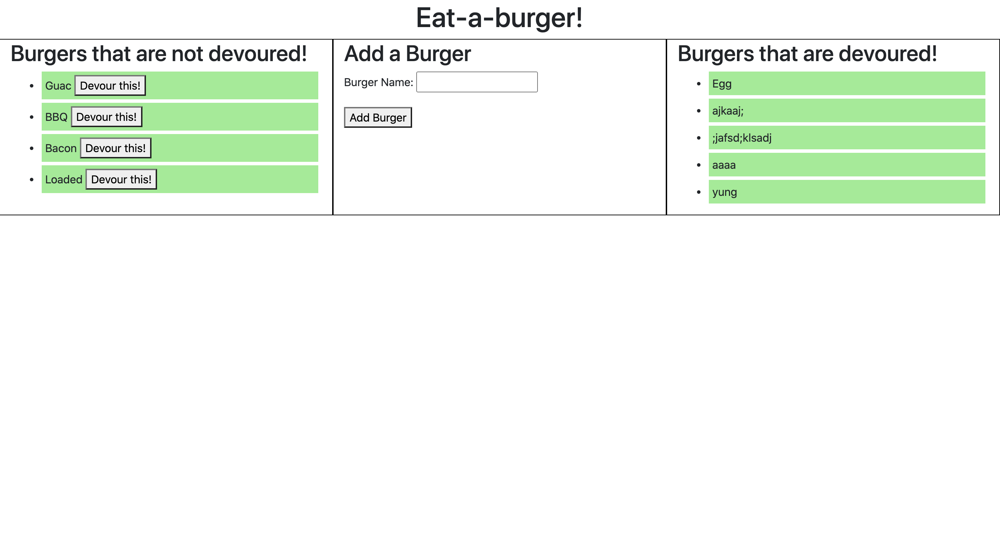

# burger

## Description
Using Node.js, Express, Handlebars, and MySQL, I created an application where you can add and devour burgers.

## Table of Contents
* [Installation](#installation)
* [Usage](#usage)
* [Questions](#questions)

## Installation
Run npm install after downloading.

## Usage
Run npm run start, if you have nodemon installed. Otherwise, run npx nodemon server.js in your command line.

## Deployed Application
https://young-harbor-86938.herokuapp.com/

## Questions
<a href="https://github.com/tmessall">Github</a>

Email me at tmessall17@gmail.com with any further questions.
